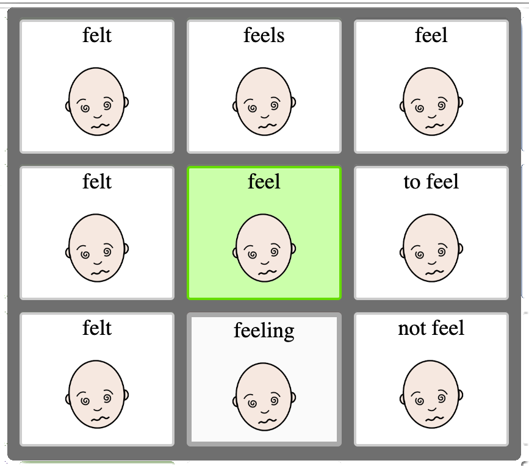

Our main areas of focus at OpenAAC is to improve
the lives of AAC users through openness and collaboration.
We do this by providing
resources and tools that make it easier for AAC support
teams to work effectively, and for AAC developers to not
have to start from scratch when implementing.

All of our materials and resources are developed with
participation from the AAC community, and we are always looking
for additional feedback, so please comment on any doc, or
hop onto our chat and share any areas where you think things
could be improved. This stuff only works if everyone helps
where they can!

<h2>Community Tools</h2>

<a href="/cpp">Communication Partner Profile (cpp v1.0)</a> 

The CPP is a self-reflection form that can be filled out by
any communication partner at any level, with the objective 
of helping identify areas of improvement in supporting AAC users.

  

  <strong style='font-weight: bold;'>Additional Handouts and Resources</strong> 
  

    <a href="">
    
    Partner-Assisted Scanning Handout
    </a>
  

  

    <a href="">
    
    Making Choices With Me Handout
    </a>
  

  

    <a href="">
    
    AAC Literacy Starter Guide
    </a>
  

  

    <a href="">
    
    Interactive Reading with AAC
    </a>
  

  

<h2>Developer Resources</h2>

<a href="/considerations">AAC Developer Considerations</a> 

The Developer Considerations tool
consists of a nearly-exhaustive list of features that are 
implemented or requested to be implemented in user-facing
AAC systems, ranked by user expectation of availability.

<h2>Specifications</h2>

<a href="https://docs.google.com/document/d/1Bnl5neOf9-y53yOAGjd8BzQ7jvAdLhcB6y9Zw7ITYbA/edit">Open Board Format (obf) Specification</a> 

obf is an open, standardized file
format for representing a single board or set of boards, enabling
users to import and export their personal vocabulary from one
AAC system or vendor to another.

<a href="https://docs.google.com/document/d/1KpC82nQc8RscgYZWKQo-y_LlKSwd8VsuvhnjrIve2f4/edit">Open Logging Format (obl) Specification</a> 

obl is an open, standardized 
logging format used to record AAC user session data. Logging
exports an be anonymized if desired, to allow
users to share their usage logs with researchers.

<a href="https://docs.google.com/document/d/1ZJAt1JkpXcHgazEkWMFxxD_l117eD21p1uEFLMqjrjA/edit">AAC "Effort" Score</a> (part of <a href="https://www.openboardformat.org/analysis">CARE Analysis</a>) 

Effort Score is an attempt to
quantitatively measure the amount of work needed for a typical
AAC user to activate a word or build a sentence in an arbitrary
AAC system. This score is a first step in trying to create an
objective, measurable system for comparing different 
AAC vocabularies.

<a href="https://docs.google.com/document/d/1JJI82jk9hPy-PHMgx5rXNhEhy8Z38-MtSF0Uirt8gFY/edit">Language Support, "Word Forms and Inflection Rules" Specification</a> 

This specification offers a 
language-agnostic tool to allow AAC developers to support
more advanced language-based features without having to 
recreate the wheel for themselves. You can
<a href="https://tools.openaac.org/inflections/inflections.html">see it in action yourself</a>
if you like!

