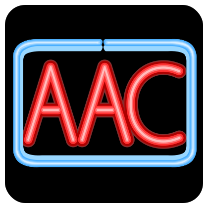

## Welcome to The OpenAAC Initiative

 
What is OpenAAC? OpenAAC is an initiative to encourage the sharing and reuse of resources meant to serve communicators and supporters using Augmentative and Alternative Communication (AAC). As the international AAC community continues to grow, groups and organizations from around the world are collecting and building repositories and tools that can be used for free by anyone who can benefit from them. This is a wonderful thing!

in the past, most material was created by vendors whose primary goal is to drive people to purchase their specific apps, and to encourage "lock-in" where users will stay with them because they have no choice. We are parents, therapists, vendors and developers who believe in a better way forward. We believe that users should have control and be able to mix and match to create the experience that works best for them. Here are some of our beliefs:

- Communicators should have an option for a free, flexible AAC system.
- Users should be free to export their vocabulary sets if they need to switch to a different AAC system ([the Open Board Format](https://openboardformat.org)). 
- People should have access to free, robust, pre-made vocabulary sets that they can import into the system that works best for them.
- Therapists and education teams should be free create and share classroom materials that use the same symbols available on AAC systems ([opensymbols.org](https://www.opensymbols.org)).
- Teachers and families should have access to free learning resources and ideas for modeling with and supporting communicator learning ([Communication Workshop](https://workshop.openaac.org)).
- Communicators should have a range of free, high-quality voice output options.
- Third parties should be able to integrate tools into AAC systems in a standardized way ([AAC Shim](https://tools.openaac.org)).

And more. The OpenAAC Initiative will be a place to find and share open-licensed tools and applications. We are in the process of organizing an advisory board to drive the strategy for this initiative, but in the mean time you can review the existing tools and resources. Remember, all of these initiatives are released with an open license, and are free to use, share and build on top of.

### Resources

- [AAC Systems](aac.md)
- [Symbol Libraries](symbols.md)
- [Learning Resources](learning.md)
- [Developer Tools](developers.md)

### Contact Us

Right now this project is in its early stages. If you would like to learn more or contribute, please [contact us](mailto: brian@mycoughdrop.com) for more information.
